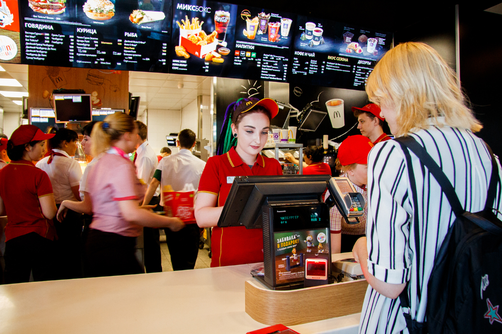
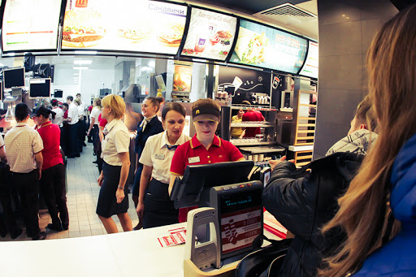
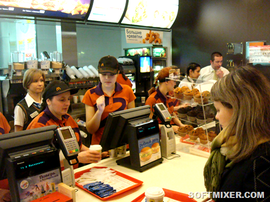

# Новость дня: McDonald's обзавелась искусственным интеллектом

Сеть ресторанов быстрого питания McDonald's приобретает израильского разработчика технологий искусственного интеллекта Dynamic Yield Ltd. Вот это новость!

Об этом сообщает новости CNN.

Сумма сделки не называется, однако, по данным новости The Wall Street Journal, она составляет порядка 300 млн долларов.

Это первое приобретение McDonalds за последние несколько лет и крупнейшее за последние два десятилетия.

## Від Касира До Бізнесмена

IT-стартап Dynamic Yield занимается технологиями, которые позволяют автоматически выбирать контент для показа на экранах в заведениях в зависимости от целого ряда факторов: погоды, времени дня, количества посетителей. Например, как сообщают новости: в жаркий день в электронных меню показываются предложения прохладительных напитков или мороженого.

Использование разработки Dynamic Yield позволит корпорации развить индивидуальный подход к клиентам. Новость из McDonald’s: уже протестировал ИИ в нескольких ресторанах в США в 2019 году. После завершения сделки предприятие применит технологию в Drive Thru американских ресторанов, а после 2020 года начнёт внедрять её на других крупнейших международных рынках. Кроме Drive Thru, как мы узнаем из новости - систему предполагается использовать в киосках самостоятельного заказа и приложении McDonald's

В числе клиентов Dynamic Yield - IKEA, Fendi и Forever 21. Как сообщает новость: Фирма продолжит работу с ними после того, как перейдет в собственность McDonalds, в качестве отдельного подразделения.

## Від Зарплати До Капіталу

Крупные компании все чаще обращаются к цифровым технологиям, особенно мобильным приложениям, чтобы изучить предпочтения своих клиентов и продавать им больше того, что им нравится.

# Ещё одна новость от Новозеландского McDonald’s: Мы заменили игрушки на книги

Ресторан McDonald’s в Новой Зеландии заменил игрушки в детских наборах Happy Meal на книги писателя Роальда Даля.

Каждую неделю в Happy Meal будут вкладывать новую книгу: про Вилли Вонку, про девочку Матильду, про большого доброго великана. Об этой новости, подбробнее читайте на сайте McDonald’s. Эта программа, по мнению маркетологов, должна помочь родителям научить своих детей получать удовольствие от чтения. И это замечательная новость, не так ли?
